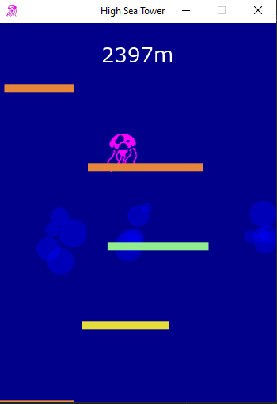
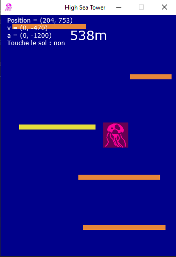

# HighSeaTower

A 2D platformer game based on Icy Tower but with a squid and some bubbles made 
with JavaFX from scratch for school.

I could maybe add some music here too.

## Table of content

- [Requirements](#requirements)
- [Getting started](#getting-started)
- [Controls](#controls)
- [Gameplay](#gameplay)
- [Debug mode](#debug-mode)
- [Screenshots](#screenshots)
- [Special thanks](#special-thanks)

## Requirements

- Java JDK 16 or later (latest recommended)
- JavaFX 11 or later

## Getting started

1. Download the Git repo using:

    ```
    git clone https://github.com/Hazot/HighSeaTower.git
    ```
   or download it manually.


3. Choose which way you want to run the program
   ####Recommended route
   If you want to run the code in an IDE, you need to:

    - have properly downloaded JavaFX.
    - set your Java JDK to the project configuration
    - add the JavaFX SDK as a library to the project
    - add to your VM arguments to your run configuration

   If you need more help towards setting up the environnement, visit: https://openjfx.io/openjfx-docs/#introduction.

   ####Other route
   If you want to run the code using command line and you need help, you can visit:
   https://openjfx.io/openjfx-docs/#install-javafx.

   I will probably setup a .jar and a build.xml in the future.

## Controls

- UP or SPACE: jump
- LEFT: go left
- RIGHT: go right
- ESCAPE: terminate the program
- R: restart the game
- T: toggle debug mode

## Gameplay

Once you make one move, the camera starts moving up. You need to go up by jumping on the platforms.
If you are not in the frame, you lose and go back to the menu.

There are different kinds of platform associated with the colors:
- Orange: Regular pass-through platforms.
- Green: Bouncing platforms. The more you bounce, the higher you go.
- Yellow: Makes the camera go down faster while touching it.
- Red: Can't go through the platform from below.

If you go too fast, the camera moves up with you.

There are cute bubbles going up in the backgrounds.

Have fun!

## Debug mode

The debug mode stops the camera from going down, highlights the platform the is touched by the player and
shows the hit box of the player.

## Screenshots

### Gameplay


### Debug mode


## Special Thanks
- Alexis
